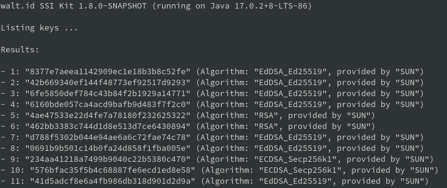

# Key Management

SSI-Kit CLI key management commands can be accessed with the `key` command. It provides the following functionality:

* [Generate key](key-management.md#generate-key) - using **gen** command
* [List keys](key-management.md#list-keys) - using **list** command
* [Import key](key-management.md#import-key) - using **import** command
* [Export key](key-management.md#export-key) - using **export** command
* [Delete key](key-management.md#delete-key) - using **delete** command

All commands have the help option available:

* `<your-command> -h`
* or `<your-command> --help`

E.g. `key gen -h`

.png>)

### Generate key

Use the `gen` command to create asymmetric key pair by the specified algorithm. Supported algorithms are:

* RSA:
  * `key gen -a RSA`
  * or `key gen --algorithm RSA`
* ECDSA Secp256k1:
  * `key gen -a Secp256k1`
  * or `key gen --algorithm Secp256k1`
* EdDSA Ed25519 (default)
  * `key gen`
  * or `key gen -a Ed25519`
  * or `key gen --algorithm Ed25519`

The returned value represents the `keyId` of the newly created key.

E.g. `key gen -a Secp256k1`

### List keys

Use the `list` command to list all keys in the key store:

* `key list`

It will output the following fields:

* key index - index within the list
* keyId - key identification number
* key algorithm - algorithm used to create the key
* crypto service - the cryptographic service used to create the key

### Import key

Use the `import` command to import a key in JWK or PEM format:

* `key import <your-key-file-path>`
  * JWK - based on the JWK key ID and key material, an internal key object will be created and placed in the corresponding key store
  * PEM - if there's no key ID in the PEM file (which is usually the case), a random key ID will be generated and, based on the key material, an internal key object will be created and placed in the corresponding key store. PEM files must have the file extension 'pem':
    * RSA keys - file should contain either the private key or private and public keys concatenated with a '_new line'_ character
    * Ed25519, Secp256k1 - file should contain both private and public keys concatenated with a '_new line_' character

E.g.

Ed25519 JWK public key

.png>)

`key import ./ed25519jwk.json`

.png>)

Secp256k1 PEM key

.png>)

`key import ./secp256k1.pem`

.png>)

### Export key

Use the `export` command to export a specified key type with the specified id and format.

Available key type:

* private (default):
  * `key export <your-key-id>`
  * or `key export <your-key-id> --priv`
* public:
  * `key export <your-key-id> --pub`

Available export formats:

* JWK (default):
  * `key export <your-key-id>`
  * or `key export <your-key-id> -f JWK`
  * or `key export <your-key-id> --key-format JWK`
* PEM:
  * `key export <your-key-id> -f PEM`
  * `key export <your-key-id> --key-format PEM`

The output will display the exported key in the specified format.

E.g.

`key export 17592087c6f04c358b9b813dbe2ef027 --pub -f PEM`

.png>)

`key export 17592087c6f04c358b9b813dbe2ef027 --pub`

.png>)

`key export 17592087c6f04c358b9b813dbe2ef027 --priv -f PEM`

 (1).png>)

`key export 17592087c6f04c358b9b813dbe2ef027 --priv`

.png>)

### Delete key

Use the `delete` command to delete a key with the specified ID:

* `key delete <your-key-id>`

E.g. `key delete 17592087c6f04c358b9b813dbe2ef027`

.png>)
