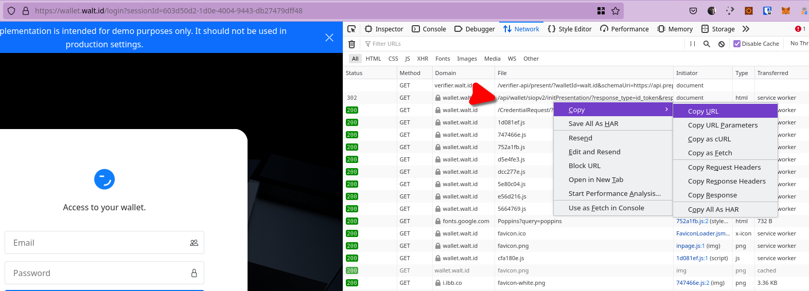

# OIDC4VP | Example

The credential presentation flow is triggered from a Verifier portal, sending an OIDC/SIOP authorization request to the wallet, which acts as a Self-Issued OpenID Provider (SIOP).

To play through the verification flow, let's start at our demo verifier web portal at:

`https://verifier.walt.id`

## SIOP request

To obtain a valid SIOP request URL from the verifier, let's open the verifier portal in a web browser.

Hit the F12 button, to open the developer tools and navigate to the "Network" tab (make sure the request type filter shows _All_ requests), like shown in the following screenshot:


Now hit the "Connect to wallet using VerifiableID" button. The verifier portal redirects to the web wallet, and you find the relevant SIOP request, in the network tab with the request URI starting as `/api/wallet/siopv2/initPresentation`, like shown in this screenshot:



We want to copy the SIOP request URL, in this example it's:

```
https://wallet.walt.id/api/wallet/siopv2/initPresentation/?response_type=id_token&response_mode=form_post&client_id=https%3A%2F%2Fverifier.walt.id%2Fverifier-api%2Fverify%2F842b3286-d581-4d6b-ad1d-16a718c28015&redirect_uri=https%3A%2F%2Fverifier.walt.id%2Fverifier-api%2Fverify%2F842b3286-d581-4d6b-ad1d-16a718c28015&scope=openid&nonce=842b3286-d581-4d6b-ad1d-16a718c28015&claims=%7B%22vp_token%22+%3A+%7B%22presentation_definition%22+%3A+%7B%22id%22+%3A+%221%22%2C+%22input_descriptors%22+%3A+%5B%7B%22id%22+%3A+%221%22%2C+%22schema%22+%3A+%7B%22uri%22+%3A+%22https%3A%2F%2Fapi.preprod.ebsi.eu%2Ftrusted-schemas-registry%2Fv1%2Fschemas%2F0xb77f8516a965631b4f197ad54c65a9e2f9936ebfb76bae4906d33744dbcc60ba%22%7D%7D%5D%7D%7D%7D
```

#### Simulate a SIOP request

_**Alternatively**_, we can simulate a SIOP request, by using the SSIKit command line interface, to generate such a request URL:

```
ssikit oidc vp gen-url -v "http://blank" -p "/verify/" -n "FOO" -s "https://api.preprod.ebsi.eu/trusted-schemas-registry/v1/schemas/0xb77f8516a965631b4f197ad54c65a9e2f9936ebfb76bae4906d33744dbcc60ba" --state "BAR"
```

Breakdown of the command:

* **-v \[...]**: Dummy verifier address
* **-p \[...]**: Dummy verification redirect path, relative to verifier address
* **-n \[...]**: Nonce to include in verifiable presentation in the SIOP response
* **-s \[...]**: Schema ID of the requested credential
* **--state \[...]**: Custom state identifier, that is looped through to the SIOP response

_Output_

```
[...]
openid://?response_type=id_token&response_mode=fragment&client_id=http%3A%2F%2Fblank%2Fverify%2F&redirect_uri=http%3A%2F%2Fblank%2Fverify%2F&scope=openid&nonce=FOO&claims=%7B%22vp_token%22+%3A+%7B%22presentation_definition%22+%3A+%7B%22id%22+%3A+null%2C+%22input_descriptors%22+%3A+%5B%7B%22id%22+%3A+null%2C+%22schema%22+%3A+%7B%22uri%22+%3A+%22https%3A%2F%2Fapi.preprod.ebsi.eu%2Ftrusted-schemas-registry%2Fv1%2Fschemas%2F0xb77f8516a965631b4f197ad54c65a9e2f9936ebfb76bae4906d33744dbcc60ba%22%7D%7D%5D%7D%7D%7D&state=BAR
```

The command prints the SIOP request URI containing the required credential types, as specified in the command parameters.

## Parse SIOP request

Continuing the real-case scenario we started on our demo verifier portal, we can copy the SIOP request URL from the browser network tab, like shown in the previous section, and inspect the SIOP request to see which credentials we have to present, using the _parse_ subcommand like this:

```
ssikit oidc vp parse -u "https://wallet.walt.id/api/wallet/siopv2/initPresentation/?response_type=id_token&response_mode=form_post&client_id=https%3A%2F%2Fverifier.walt.id%2Fverifier-api%2Fverify%2F842b3286-d581-4d6b-ad1d-16a718c28015&redirect_uri=https%3A%2F%2Fverifier.walt.id%2Fverifier-api%2Fverify%2F842b3286-d581-4d6b-ad1d-16a718c28015&scope=openid&nonce=842b3286-d581-4d6b-ad1d-16a718c28015&claims=%7B%22vp_token%22+%3A+%7B%22presentation_definition%22+%3A+%7B%22id%22+%3A+%221%22%2C+%22input_descriptors%22+%3A+%5B%7B%22id%22+%3A+%221%22%2C+%22schema%22+%3A+%7B%22uri%22+%3A+%22https%3A%2F%2Fapi.preprod.ebsi.eu%2Ftrusted-schemas-registry%2Fv1%2Fschemas%2F0xb77f8516a965631b4f197ad54c65a9e2f9936ebfb76bae4906d33744dbcc60ba%22%7D%7D%5D%7D%7D%7D"
```

_Output_

```
[...]
Requested credentials:
- VerifiableId
Schema ID: https://api.preprod.ebsi.eu/trusted-schemas-registry/v1/schemas/0xb77f8516a965631b4f197ad54c65a9e2f9936ebfb76bae4906d33744dbcc60ba
```

The command prints the requested credentials and their schema IDs. Now we can create and send the SIOP response to the verifier portal.

## SIOP response

Using the SIOP request URL we got in the previous sections, we can now generate and post the SIOP response, using the DID and credential issued in the [issuance credential request example](usage-examples-1.md#credential-request), to the verifier portal like so:

```
ssikit oidc vp present -u "https://wallet.walt.id/api/wallet/siopv2/initPresentation/?response_type=id_token&response_mode=form_post&client_id=https%3A%2F%2Fverifier.walt.id%2Fverifier-api%2Fverify%2F842b3286-d581-4d6b-ad1d-16a718c28015&redirect_uri=https%3A%2F%2Fverifier.walt.id%2Fverifier-api%2Fverify%2F842b3286-d581-4d6b-ad1d-16a718c28015&scope=openid&nonce=842b3286-d581-4d6b-ad1d-16a718c28015&claims=%7B%22vp_token%22+%3A+%7B%22presentation_definition%22+%3A+%7B%22id%22+%3A+%221%22%2C+%22input_descriptors%22+%3A+%5B%7B%22id%22+%3A+%221%22%2C+%22schema%22+%3A+%7B%22uri%22+%3A+%22https%3A%2F%2Fapi.preprod.ebsi.eu%2Ftrusted-schemas-registry%2Fv1%2Fschemas%2F0xb77f8516a965631b4f197ad54c65a9e2f9936ebfb76bae4906d33744dbcc60ba%22%7D%7D%5D%7D%7D%7D" -d did:key:z6Mktxjvto1vueoMXiiAtLQiCrDPd2Xoi47isAnjK12nETRX -c urn:uuid:aa1a51cd-3ad2-49fe-ae3e-5ae50c4aed3b
```

Command breakdown:

* **-u \[...]**: The SIOP request URL copied from the browser network tab
* **-d \[...]**: The DID to use, for signing the verifiable presentation
* **-c \[...]**: The ID of the credential to include in the verifiable presentation

_Output_

```
Presentation response:
{
    id_token=[...],
    vp_token={
        "@context" : [
            "https://www.w3.org/2018/credentials/v1"
        ],
        "holder" : "did:key:z6Mktxjvto1vueoMXiiAtLQiCrDPd2Xoi47isAnjK12nETRX",
        "id" : "urn:uuid:d8a1e5e2-4cb7-4e15-91e8-9c3ed3bad1a5",
        "proof" : {
            "created" : "2022-03-11T13:24:13Z",
            "creator" : "did:key:z6Mktxjvto1vueoMXiiAtLQiCrDPd2Xoi47isAnjK12nETRX",
[...]
        },
        "type" : [
            "VerifiablePresentation"
        ],
        "verifiableCredential" : [
            {
                "@context" : [
                    "https://www.w3.org/2018/credentials/v1"
                ],
[...]
                "credentialSubject" : {
[...]
                    "id" : "did:key:z6Mktxjvto1vueoMXiiAtLQiCrDPd2Xoi47isAnjK12nETRX",
[...]
                },
[...]
                "id" : "urn:uuid:aa1a51cd-3ad2-49fe-ae3e-5ae50c4aed3b",
[...]
}

[...]

Response:
https://verifier.walt.id/success/?access_token=88213206-18ae-4102-9b82-05f10055d6d7
```

The command prints the SIOP response object and the **redirection address**, to which we now have to point our web browser, in order to complete the presentation flow.

The verifier portal shows a successful verification, like shown by this screenshot:


