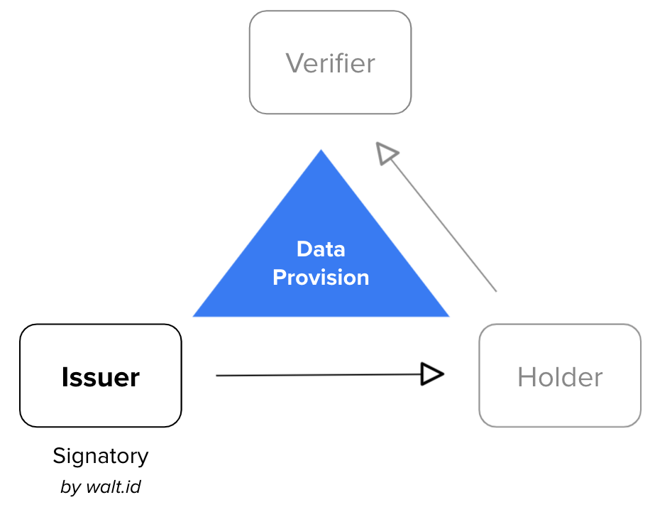

# SSI Kit 101

## What is the SSI Kit?

The SSI Kit offers **everything you need to use Self-Sovereign Identity** (SSI).&#x20;

What you need to know about the SSI Kit:

* It is written in **Kotlin/Java**. **** It can be directly integrated (Maven/Gradle dependency) or run as RESTful web-service. A CLI tool allows you to run all functions manually.
* It is fully **open source (Apache 2).** You can use the code for free and without strings attached. &#x20;
* It is a holistic solution that allows you to **build** **use cases “end-to-end”.** There is no need to research, combine or tweak different libraries to build pilots or production systems.
* It **abstracts complexity** and low-level functionality via different interfaces (CLI, APIs). Additional services **facilitate development and integration** (e.g. Issuer and Verifier Portals).
* It is **modular, composable and built on open standards** allowing you to customize and extend functionality with your own or third party implementations and to **** preventing lock-in.&#x20;
* It is **flexible** in a sense that you can deploy and run it on-premise, in your (multi) cloud environment or as a library in your application.&#x20;
* It enables you to **use different identity ecosystems** like Europe’s emerging identity ecosystem ([EBSI, ESSIF](https://ec.europa.eu/digital-building-blocks/wikis/display/ebsi)) in anticipation of a multi-ecosystem future.

## Functionality

The SSI Kit establishes an identity infrastructure layer for any use case in any industry. Its core services are in the scope of:

* **Registry Interactions** (e.g. read, write; agnostic towards the underlying tech e.g. DLT, DNS)
* **Key Management** (e.g. generate, sign, import, export, manage lifecycle)
* **Decentralized Identifier (DID)** operations (e.g. register, resolve, manage lifecycle)
* **Verifiable Credential/Presentations (VC, VP)** operations (e.g. create, issue, present, verify)
* **Ecosystem specific use cases** (e.g. onboarding, data exchange and monetization)

_Illustration:_

## Components

The SSI Kit unifies three components: Signatory, Custodian and Auditor.

### Signatory | For Issuers

Signatory allows you to digitize paper credentials and automate data provision to your stakeholders.

It provides all functionality required by “Issuers”. For example:

* Process and authenticate data requests by people or organisations,
* Import data (from local storage or third parties),
* Create re-usable VC templates,
* Create VCs in different formats (e.g. JSON/JWT, JSON-LD),
* Sign VCs using different key types (e.g. ed25519, secp256K1, RSA),
* Manage the lifecycle of VCs (e.g. revocation).
* Issue VCs (e.g. via OIDC/SIOP)

### Custodian | For Holders

Custodian is a secure data hub for people and organizations. It provides all functionality required by “Holders”. For example:

* Interact with Registries (read, write)
* Create, store, manage keys, data (DIDs, VCs) and other secrets,
* Request and import data (VCs) from third parties,
* Selectively disclose data (VCs/VPs) for authentication and identification,
* Manage consent and data access in a user-centric fashion.

### Auditor | For Verifiers 

Auditor allows you to verify your stakeholders’ identity data and offer frictionless access to services or products. It provides all functionality required by “Verifiers”. For example:

* request data (VCs/VPs) from stakeholders,
* verify data (VCs/VPs; incl. integrity, validity, provenance, authenticity),
* trigger pre-defined actions following the verification.

