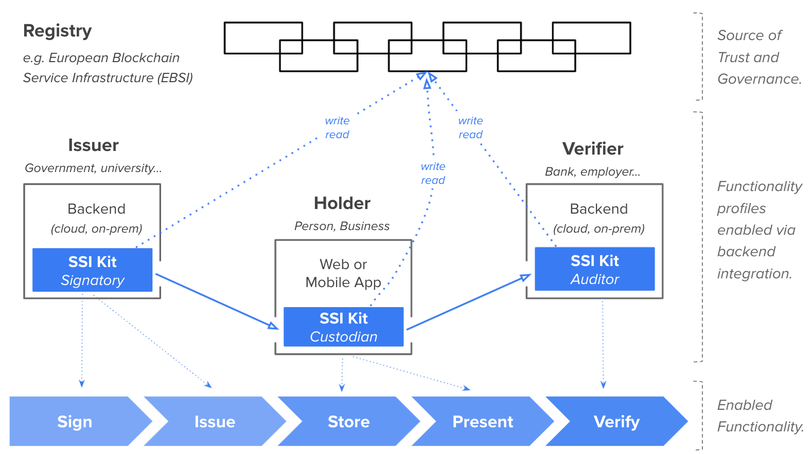

# SSI Kit 101

## TL;DR

**The SSI Kit offers developers and organisations everything they need to use SSI** via a unified solution for building use cases or applications fast and without much complexity or prior knowledge about SSI.&#x20;

Here’s the most important things to know about the SSI Kit:

* It is fully **open source (Apache 2)**, i.e. anyone can use the code for free and without limitations. Think of it as a public good for developers by developers (from walt.id and our dev community). &#x20;
* It is a holistic solution that allows you to **build** **use cases “end-to-end”.** There is no need to research, combine or tweak different libraries in order to build pilots or production systems.
* It **abstracts complexity** via different interfaces like a CLI Tool and RESTful APIs. Apart from the abstracted core infrastructure (Signatory, Custodian, Auditor) which enables low-level functionality (like key handling, data storage, signing), additional services **facilitate development and integration** even further (like “Data Providers” or “Issuer/Verifier Portals”, which connect your databases and web services with SSI core infrastructure).
* It is **modular, composable and built on open standards** allowing you to individualise and extend functionality with your own or third party implementations. This openness **prevents** **lock-in** and enables you to **build solutions that meet your requirements** without compromise.&#x20;
* It is **flexible** in a sense that you can deploy and run it on-premise, in your (multi) cloud environment or as a library in your application.&#x20;
* It enables you to **use different identity ecosystems** like Europe’s Blockchains Service Infrastructure ("EBSI") and Self-Sovereign Identity Framework (“ESSIF”). Anticipating a multi-ecosystem future, the SSI Kit abstracts and supports different ecosystems (incl. different governance frameworks, business logic, tech specs, ...).

## What is the SSI Kit?

The SSI Kit bundles our products (“Signatory” for Issuers, “Custodian” for Holders, “Auditor” for Verifiers) in a unified solution that enables developers and organisations to use Self-Sovereign Identity (SSI) with ease.

The SSI Kit is a set of libraries that anyone can use to establish an identity infrastructure layer to power complex, low-level SSI operations for potentially any use case in any industry. In short, it enables all functionality required to use SSI, such as:

* Interactions with Registries which can be based on different technologies like the European Blockchain “EBSI”.
* Decentralised Identifiers (DIDs) and Keys, including generation, signing, anchoring, resolution and lifecycle management.
* Verifiable Credentials (VCs) and Verifiable Presentations (VP), including singing, issuance, verification, lifecycle management.
* Data exchange based on different protocols, including the exchange of VCs and VPs.

_Illustration:_

